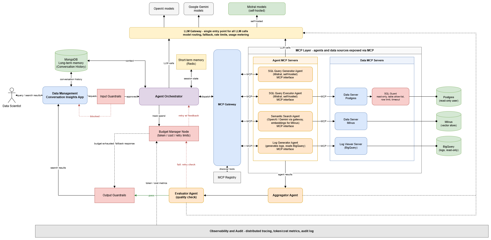

# Data Management Conversational Insights

**Conversational Insights** is an AI-driven, agent-based platform that lets data scientists ask questions in natural language and get insights from complex subsurface data. It combines large language models (LLMs), retrieval-augmented generation (RAG) and orchestration frameworks (LangGraph, Model Context Protocol) to coordinate retrieval, reasoning and response generation across structured and unstructured data sources.

## Architecture Overview

The platform uses a multi-agent architecture. A central **Agent Orchestrator** (built on LangGraph) receives each validated request, plans the work and delegates it to specialist agents. Every agent, and every data source, is exposed through the **Model Context Protocol (MCP)**, so the orchestrator discovers and calls capabilities through a single, governed interface instead of custom integrations.

Key design principles:

- **Agents as MCP servers.** Each specialist agent exposes an MCP interface. Agents call data sources through MCP servers as well, so new agents or data sources are added by registering them in the MCP Registry.
- **Hybrid retrieval.** Structured data is reached through generated SQL (Postgres). Unstructured and semantic content is reached through vector search (Milvus). Logs are read from BigQuery.
- **One LLM gateway, multiple models.** All LLM calls go through an LLM Gateway that routes between OpenAI, Google Gemini and self-hosted Mistral models. SQL agents use the self-hosted Mistral models, so schema and query data stay in our own infrastructure.
- **Guardrails at both ends.** Input Guardrails validate requests before orchestration. Output Guardrails check responses before they reach the user.
- **Safe data access.** LLM-generated SQL passes through a SQL Guard (read-only, table allow-list, row limit, timeout) and runs under a read-only database user.
- **Bounded self-correction.** An Evaluator Agent checks answer quality. A Budget Manager decides whether a failed answer is retried with feedback, within token, cost and retry limits, or returns a fallback response.
- **Observable by default.** Tracing, token and cost metrics and an audit log cover every component.

## Architecture Diagram

*Source: [`Conversational_Insights_Architecture.drawio`](Conversational_Insights_Architecture.drawio). Edit the draw.io file and re-export the PNG when the architecture changes.*

## Request Flow

1. The data scientist submits a question in the app. The app stores the exchange in conversation history (MongoDB).
2. **Input Guardrails** validate the request. A blocked request returns to the app with a message.
3. The **Agent Orchestrator** loads short-term and long-term memory, plans the work and dispatches tasks through the **MCP Gateway**.
4. The specialist agents run through their MCP interfaces:
   - **Hybrid Search** retrieves relevant content and schema context from Milvus by combining semantic search with BM25-based keyword search.
   - **SQL Generator** produces SQL, and **SQL Executor** runs it on Postgres behind the SQL Guard.
   - **Log Generator** reads logs from BigQuery when log analysis is needed.
5. The **Aggregator Agent** combines the agent results into a single answer.
6. The **Evaluator Agent** checks the answer.
   - **Pass:** the answer goes through **Output Guardrails** and returns to the user as search results.
   - **Fail:** the **Budget Manager** checks the remaining budget. If budget remains, the orchestrator retries with the evaluator's feedback. If not, a fallback response goes through Output Guardrails.
   
## Components

### Entry and safety

| Component | Responsibility |
|---|---|
| **DM Conversational Insights App** | User-facing application. Accepts queries, returns search results and stores conversation history. |
| **Input Guardrails** | Validate and filter incoming requests. Blocked requests return to the app without reaching the orchestrator. |
| **Output Guardrails** | Check responses (including fallback responses) before they are returned to the user. |

### Orchestration and memory

| Component | Responsibility |
|---|---|
| **Agent Orchestrator** | LangGraph-based workflow. Plans each request, dispatches tasks to agents through the MCP Gateway and manages retries. |
| **Short-term memory** | Session state for the current conversation (session store, for example Redis). |
| **Long-term memory (MongoDB)** | Conversation history, used for context across turns and sessions. |
| **Budget Manager** | Tracks token, cost and retry limits. Decides between retry with feedback and a fallback response when the Evaluator fails an answer. |

### Agents (exposed as MCP servers)

| Agent | Role | Model |
|---|---|---|
| **Semantic Search Agent** | RAG retrieval over unstructured content and schema context from Milvus. Creates embeddings for vector search. | OpenAI / Gemini via the LLM Gateway |
| **SQL Query Generator Agent** | Turns the question and retrieved context into SQL. | Mistral (self-hosted) |
| **SQL Query Executor Agent** | Runs validated SQL against Postgres through the Data MCP Server. | Mistral (self-hosted) |
| **Log Generator Agent** | Generates logs and reads them from BigQuery through the Log Viewer Server. | Via the LLM Gateway |
| **Aggregator Agent** | Combines results from the specialist agents into a single answer. | Via the LLM Gateway |
| **Evaluator Agent** | Checks answer quality. On a pass the answer goes to Output Guardrails. On a fail the Budget Manager decides what happens next. | Via the LLM Gateway |

Agent-to-agent hand-offs (for example schema context passed to the SQL Generator, or SQL passed to the Executor) are routed through the MCP Gateway, so they stay auditable and count against the budget.

### MCP layer

| Component | Responsibility |
|---|---|
| **MCP Gateway** | Single policy point: authentication, RBAC, rate limiting and tool discovery for agent and data tiers. |
| **MCP Registry** | Catalog of available agent and data MCP servers. |
| **Data Server (Postgres)** | Structured data access. All SQL passes through the **SQL Guard** (read-only, table allow-list, row limit, timeout) and runs as a read-only database user. |
| **Data Server (Milvus)** | Vector search over embedded content. |
| **Log Viewer Server** | Read-only access to logs stored in BigQuery. |

### LLM Gateway

All LLM calls from the orchestrator, agents, aggregator and evaluator go through one gateway that handles model routing, fallback, rate limits and usage metering. It routes to:

- **OpenAI models**
- **Google Gemini models**
- **Mistral models**, hosted in our own infrastructure

### Observability and audit

Distributed tracing, token and cost metrics and an audit log cover all components. Token and cost metrics also feed the Budget Manager.

## Technology Summary

| Area | Technology |
|---|---|
| Orchestration | LangGraph |
| Tool and agent interface | Model Context Protocol (MCP) |
| LLMs | OpenAI, Google Gemini, Mistral (self-hosted) |
| Structured data | Postgres |
| Vector search / RAG | Milvus |
| Logs | BigQuery |
| Conversation memory | MongoDB (long-term), Redis (short-term) |

