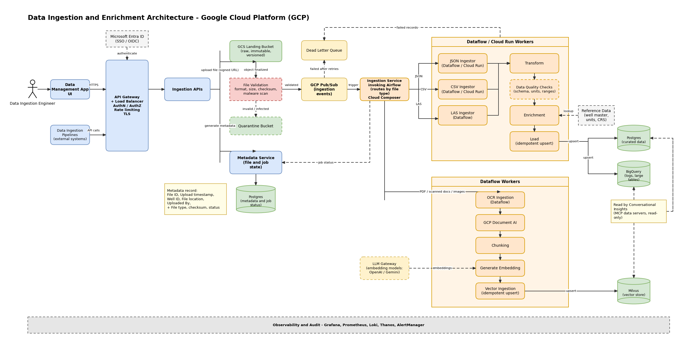
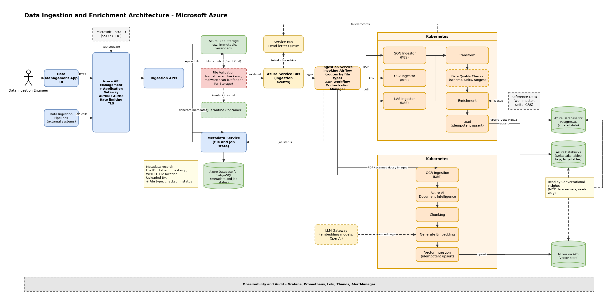
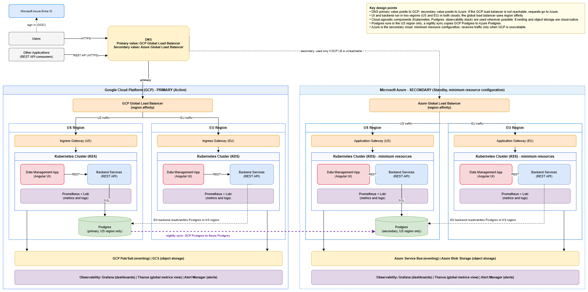

# Data Management Ingestion and Enrichment

**Data Ingestion and Enrichment** is a cloud-native, highly scalable framework, with an accompanying Data Management Portal, for bringing Exploration and Production (E&P) data into one governed platform. It ingests data from diverse sources and formats, then transforms, validates and enriches it into standardized Well-Known Entities (WKEs). Domain experts can then search, discover and analyse millions of oil and gas domain entities through a unified platform. The curated data it produces is read by the [Conversational Insights](https://github.com/sanjeetkhanuja/architecture-docs/blob/main/Conversational_Insights/README.md) platform.

**The solution is available on both Google Cloud Platform (GCP) and Microsoft Azure.** The reference deployment described in [Deployment Architecture](#deployment-architecture-multi-cloud) goes further and runs the Data Management App and Backend Services across both clouds for resilience, with GCP as primary and Azure as standby.

## Architecture Overview

Both implementations are event-driven. A file is uploaded through a secured API, stored unchanged, validated, and announced on a message queue. An orchestration service then routes it to the right processing path by file type. Structured files (JSON, CSV, LAS) pass through Transform, Data Quality Checks and Enrichment before they are loaded into curated stores. Unstructured files (PDF, scanned documents, images) pass through OCR, document AI, chunking and embedding before they are loaded into a vector store.

Key design principles:

- **Secure single entry point.** The Data Management App UI and external ingestion pipelines call the same API gateway. The gateway handles authentication and authorization (SSO through Microsoft Entra ID).
- **Raw data is never changed.** Uploaded files land in an immutable, versioned store. All processing works from that copy.
- **Validate before processing.** Every file is checked for format, size, checksum and malware before an ingestion event is published. Invalid or infected files go to quarantine.
- **Event-driven and resilient.** Validated files publish an event to a message queue. Events that fail after retries, and records that fail during processing, go to a dead-letter queue.
- **Routing by file type.** The Ingestion Service (Airflow) sends JSON, CSV and LAS files to structured ingestors, and PDFs, scanned documents and images to the OCR path.
- **Quality and enrichment built in.** Structured data passes schema, unit and range checks, then is enriched using reference data (well master, units, CRS).
- **Idempotent loads.** Loads into curated stores and vector ingestion use upserts, so a retried or replayed file does not create duplicates.
- **Tracked end to end.** A Metadata Service records every file and job (file ID, timestamp, well ID, location, uploaded by, type, checksum, status) in Postgres.
- **Observable by default.** Grafana, Prometheus, Loki, Thanos and AlertManager cover tracing, metrics, logs and alerting for every component.

## Architecture Diagrams

### Google Cloud Platform (GCP)

*Source: [`Ingestion_Enrichment_GCP_Architecture.drawio`](Ingestion_Enrichment_GCP_Architecture.drawio)*

### Microsoft Azure

*Source: [`Ingestion_Enrichment_Azure_Architecture.drawio`](Ingestion_Enrichment_Azure_Architecture.drawio)*

## Deployment Architecture (Multi-Cloud)

*Source: [`Deployment_Architecture.drawio`](Deployment_Architecture.drawio)*

The reference deployment of the Data Management App and Backend Services spans both clouds in an active-passive setup. GCP is the primary cloud and carries all normal traffic. Azure is the secondary cloud: it runs with a minimum resource configuration and receives traffic only if GCP is unavailable. This is separate from the cloud-specific implementations above, which show how the ingestion and enrichment pipelines are built on each cloud's services.

### Overview

- **Application.** The Data Management App is an Angular single-page UI. Users sign in through Microsoft Azure Entra ID (OIDC / SSO). The Backend Services are also exposed as a REST API, so other applications can call them directly.
- **Multi-cloud with DNS failover.** The primary DNS value points to the GCP global load balancer and the secondary value points to the Azure global load balancer. If the GCP load balancer is not reachable, requests go to Azure.
- **Two regions in each cloud.** The UI and the backend run in a US region and an EU region on both clouds. A global load balancer routes each request to the correct region using region affinity. In Azure, an Application Gateway in each region receives the traffic. In GCP, an ingress gateway does the same.
- **Kubernetes.** In every region, the UI and the Backend Services run in a Kubernetes (K8S) cluster. Azure's clusters are kept at minimum resources.
- **Cloud-agnostic by default.** Kubernetes, Postgres and the observability stack are the same on both clouds. Only eventing and object storage are cloud-native: Pub/Sub and GCS on GCP, Service Bus and Blob Storage on Azure.
- **Postgres in the US only.** Postgres runs in the US region of each cloud. The EU backends read and write it across regions. A nightly sync copies data from GCP Postgres to Azure Postgres so the secondary stays in step.
- **Observability.** Prometheus and Loki collect metrics and logs in each cluster. Grafana, Thanos and Alert Manager provide dashboards, a global metrics view and alerting in each cloud.

### Deployment at a glance

| Aspect | GCP (primary) | Azure (secondary) |
|---|---|---|
| Role | Active, receives all normal traffic | Standby, receives traffic only if GCP is unavailable |
| DNS | Primary value | Secondary value |
| Global load balancing | GCP Global Load Balancer (region affinity) | Azure Global Load Balancer (region affinity) |
| Regional entry | Ingress Gateway (US, EU) | Application Gateway (US, EU) |
| Regions | US and EU | US and EU |
| Compute | Kubernetes cluster per region | Kubernetes cluster per region, minimum resources |
| Eventing | Pub/Sub | Service Bus |
| Object storage | GCS | Azure Blob Storage |
| Postgres | Primary, US region only | Secondary, US region only, refreshed by the nightly sync |
| Observability | Prometheus, Loki, Grafana, Thanos, Alert Manager | Prometheus, Loki, Grafana, Thanos, Alert Manager |

### Request routing and failover

1. A user opens the Data Management App, or another application calls the REST API. Both use the same DNS name.
2. DNS resolves to the GCP global load balancer (primary value). The user signs in through Microsoft Azure Entra ID.
3. The global load balancer sends the request to the US or EU region using region affinity. The regional gateway forwards it to the UI or the Backend Services in that region's Kubernetes cluster.
4. The Backend Services read and write Postgres in the US region. EU backends make this call across regions.
5. If the GCP load balancer is not reachable, DNS returns the secondary value and requests go to the Azure global load balancer. They follow the same routing through the Azure regions.
6. A nightly sync from GCP Postgres to Azure Postgres keeps the Azure data in step with GCP.

## Patents

The framework and its workflows are covered by the following patents:

| Title | Publication | Link |
|---|---|---|
| **Geologic Formation Operations Framework** | US 2021/0026030 A1 (granted as US 11,644,595 B2) | https://patents.google.com/patent/US20210026030A1/en |
| **Geologic Formation Operations Relational Framework** | US 2021/0019351 A1 (granted as US 11,907,300 B2) | https://patents.google.com/patent/US20210019351/en |

The relational framework patent describes accessing data generated during field operations, building a graph of vertices and edges that represent relationships between entities, and answering queries using that graph.

## Components

### Entry and security

| Component | Responsibility |
|---|---|
| **Data Management App UI** | User-facing portal where the data ingestion engineer uploads and manages data. |
| **Data Ingestion Pipelines** | External systems that send data to the platform through the API. |
| **Microsoft Entra ID** | Single sign-on (SSO / OIDC) for the gateway. |
| **API Gateway** | Single policy point: authentication and authorization, rate limiting and TLS. GCP uses API Gateway with a Load Balancer. Azure uses API Management with Application Gateway. |
| **Ingestion APIs** | Receive uploads, store the raw file in the landing store and ask the Metadata Service to create the file record. |

### Landing, validation and events

| Component | Responsibility |
|---|---|
| **Landing store** | Raw, immutable, versioned copy of every uploaded file. GCP: GCS landing bucket. Azure: Azure Blob Storage. |
| **File Validation** | Checks format, size, checksum and malware when a file arrives. On Azure, malware scanning uses Defender for Storage. |
| **Quarantine store** | Holds invalid or infected files. GCP: quarantine bucket. Azure: quarantine container. |
| **Metadata Service** | Creates and updates file and job records in Postgres. Each record holds file ID, upload timestamp, well ID, file location, uploaded by, file type, checksum and status. |
| **Event queue** | Carries ingestion events for validated files. GCP: Pub/Sub. Azure: Service Bus. |
| **Dead-letter queue** | Receives events that fail after retries, and records that fail during processing. |

### Orchestration and processing

| Component | Responsibility |
|---|---|
| **Ingestion Service (Airflow)** | Triggered by the event queue. Routes each file by type, starts the matching processing path and writes job status back to the Metadata Service. GCP uses Cloud Composer. Azure uses ADF Workflow Orchestration Manager. |
| **JSON, CSV and LAS Ingestors** | Read structured files and pass them to the Transform stage. |
| **Transform** | Converts parsed data into the platform's standard structure. |
| **Data Quality Checks** | Validates schema, units and ranges. |
| **Enrichment** | Adds reference data (well master, units, CRS) to produce standardized entities. |
| **Load** | Idempotent upsert into the curated stores. |
| **Reference Data** | Well master, units and coordinate reference systems used for lookups during Enrichment. |

### Unstructured data path (PDF, scanned documents, images)

| Component | Responsibility |
|---|---|
| **OCR Ingestion** | Extracts text from scanned documents and images. |
| **Document AI** | Document understanding. GCP: GCP Document AI. Azure: Azure AI Document Intelligence. |
| **Chunking** | Splits extracted content into chunks for embedding. |
| **Generate Embedding** | Creates embeddings through the LLM Gateway. GCP uses OpenAI or Gemini embedding models. Azure uses OpenAI. |
| **Vector Ingestion** | Idempotent upsert of embeddings into Milvus. |

### Curated data stores

| Store | Content | GCP | Azure |
|---|---|---|---|
| **Curated relational data** | Standardized entities | Postgres | Postgres |
| **Logs and large tables** | High-volume data | BigQuery | Azure Databricks |
| **Vector store** | Embeddings for semantic search | Milvus | Milvus |

These stores are read, read-only, by the Conversational Insights MCP data servers.

### Compute

| Path | GCP | Azure |
|---|---|---|
| Structured ingestion (JSON, CSV, LAS) | Dataflow workers (JSON and CSV ingestors can also run on Cloud Run) | Kubernetes |
| Unstructured ingestion (OCR to vector) | Dataflow workers | Kubernetes |

### Observability and audit

Grafana, Prometheus, Loki, Thanos and AlertManager cover distributed tracing, metrics, logs and alerting across all components.

## Processing Flow

1. The engineer uploads a file through the Data Management App UI, or an external pipeline calls the API. The request goes through the API gateway, which authenticates it against Microsoft Entra ID.
2. The **Ingestion APIs** store the raw file in the landing store (GCP uses a signed URL for the upload) and ask the **Metadata Service** to create the file record.
3. When the file arrives, **File Validation** checks format, size, checksum and malware.
   - **Invalid or infected:** the file goes to the quarantine store.
   - **Valid:** an ingestion event is published to the event queue. Events that fail after retries go to the dead-letter queue.
4. The event triggers the **Ingestion Service**, which routes the file by type and records job status in the Metadata Service.
5. **Structured files (JSON, CSV, LAS):** the matching ingestor reads the file, then Transform, Data Quality Checks and Enrichment run in order, using Reference Data for lookups. **Load** upserts the result into the curated Postgres database and the large-table store.
6. **Unstructured files (PDF, scanned documents, images):** OCR Ingestion and document AI extract the content, Chunking splits it, the LLM Gateway generates embeddings, and Vector Ingestion upserts them into Milvus.
7. Records that fail during processing go to the dead-letter queue.
8. The Conversational Insights MCP data servers read the curated stores, read-only.

## Technology Summary

| Area | Technology |
|---|---|
| Cloud platforms | Google Cloud Platform, Microsoft Azure |
| Identity | Microsoft Entra ID (SSO / OIDC) |
| Orchestration | Apache Airflow |
| Processing | Dataflow, Cloud Run (GCP); Kubernetes (Azure) |
| Messaging | Pub/Sub (GCP); Service Bus (Azure) |
| Structured data | Postgres |
| Logs and large tables | BigQuery (GCP); Databricks (Azure) |
| Vector search | Milvus |
| Document processing | GCP Document AI (GCP); Azure AI Document Intelligence (Azure) |
| Embeddings | OpenAI, Gemini (GCP); OpenAI (Azure) |
| Observability | Grafana, Prometheus, Loki, Thanos, AlertManager |

